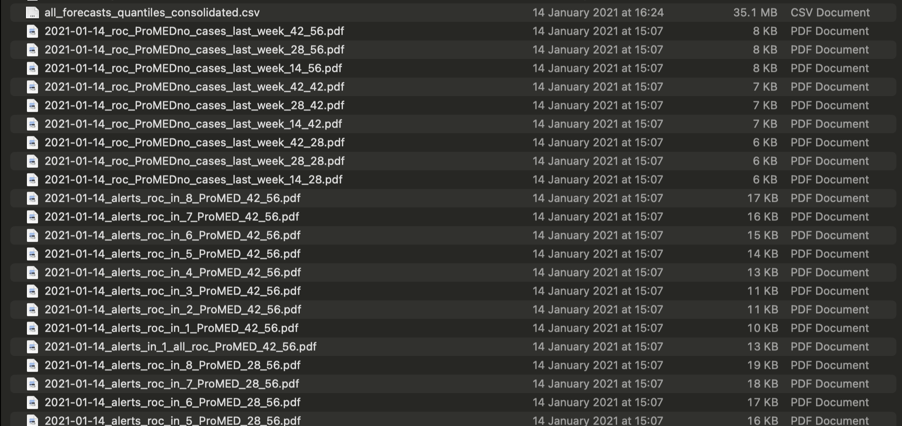

## Motivation {.centered}

{width = 80%}
  
<div class="notes">
  If your work folder looks like this (or a fancier version of this), you need help.
  We all want to be organised and trying to organise ourselves by putting meta-data in filenames is a natural impulse.
  However, this is (a) fragile, (b) rarely scalable, and (c) addresses only part of the problem.
</div>

## Typical analysis pipeline 

   1. collect data
   2. clean data
   3. make figures
   4. fit model
   5. write results
   6. submit to journal
   7. get rejected
   8. go to step 6

  <div class="notes">
  We will typically have several versions of a piece of analyses on our machines, differing in small or big ways.
  We will run the same piece of code with different parameters, try different figure formats, fix bugs in our code,
  have multiple revisions of a manuscript. How can we ensure we know what inputs produced what outputs? This is where
  orderly comes in. 
  </div>
  
## orderly (== orderly2) is a book-keeping tool 

  - orderly maintains a **_complete_** and **_transparent_** audit-trail of all inputs and outputs 
  - It builds a graph of dependancies between different versions of analysis
  - You can interrogate this graph in complex ways
  

## orderly vocabulary

  - a step of an analysis pipeline -->  "orderly task"
  - an input can be 
      - an "orderly resource" --> data, script, rmarkdown, anything else
      - an "orderly dependancy"  --> output from an upstream task
  - an output --> "orderly artefact" (data, figure, html, pdf, anything else)
  - output of an "orderly_run" command --> packet
  - parameter --> parameter passed to orderly task

## orderly task

  - orderly task is a folder under the src folder in your orderly project
  - it should contain a file "orderly.R"

## typical orderly.R 

  ```{r eval = FALSE}
    library(orderly2)

  orderly_parameters(...)

  orderly_artefact(description, files)

  orderly_dependency(name, query, files)

  orderly_resource(files)

  ## your typical R code
  
  ## Make sure your code creates the files declared in orderly_artefact
  
  ```          

## running an orderly task

  - you develop an orderly task as you would write any other R script
  - you then run it using 'orderly_run'
  - orderly will then
      - prepare the environment,
      - copy all your inputs and outputs in one directory (i.e., folder)
          - this will be in the "draft" or "archive" folder in your orderly project
      - record all parameters passed to the task
      - record any other meta-data associated with the running of the task

## running an orderly task

  - outputs (packets) will be in the draft/archive folder in your orderly project
  - these are **not** to be version-controlled via git
  - typically used as dependacies downstream

## priority-pathogens development roadmap

  ```{r eval = FALSE}
  ## src
  ## ---- db_extraction
  ## ---- db_double
  ## ---- db_compilation
  ## ---- ebola_cfr
  ## ---- ebola_delays
  ## ---- lassa_cfr
  ## ---- lassa_delays
  ## ---- ...
  ## ---- ...  
  ```    
  <div class="notes">
    Some tasks will be common across pathogens, there will be a set of
  pathogen-specific tasks.
  </div>

## priority-pathogens interaction with epireview

  - epireview is intended as a data package
  - all cleaned data will be made available via epireview
  - to maintain a single source of truth, we expect that all pathogen-specific tasks will *pull data from epireview*
  - common plotting functions will live in epireview
  - data checks will be implemented in epireview
  - we can continue to port *reusable* functionality to epireview
  - expect continuous refactoring, set-up tests for your data
  
  
  